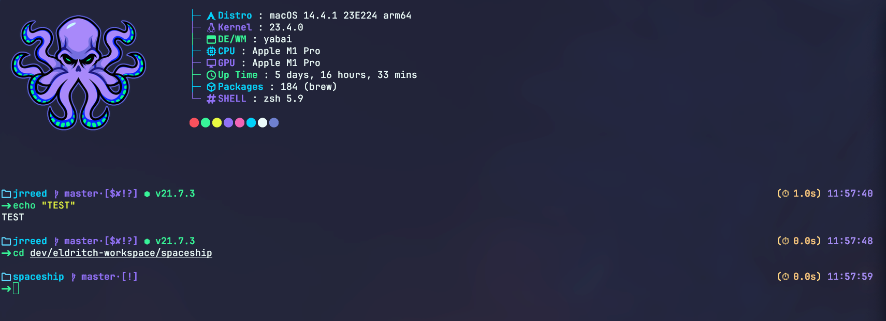

<!-- DO NOT CHANGE THIS -->

Eldritch is a community-driven dark theme inspired by Lovecraftian horror. With tones from the dark abyss and an emphasis on green and blue, it caters to those who appreciate the darker side of life.

Main Theme repo can be found [here](https://github.com/eldritch-theme/eldritch)

### Showcase
<!-- Your screenshot should go here -->
 

### Installation
1. If you just want the colors, simply using a terminal theme of ours will give you that 
2. ***(Optional)***: If you want the example screenshot above:
   1. Clone the repo or download the `spaceship.zsh` file
   2. `cp spaceship.zsh $(SPACESHIP_CONFIG)`
